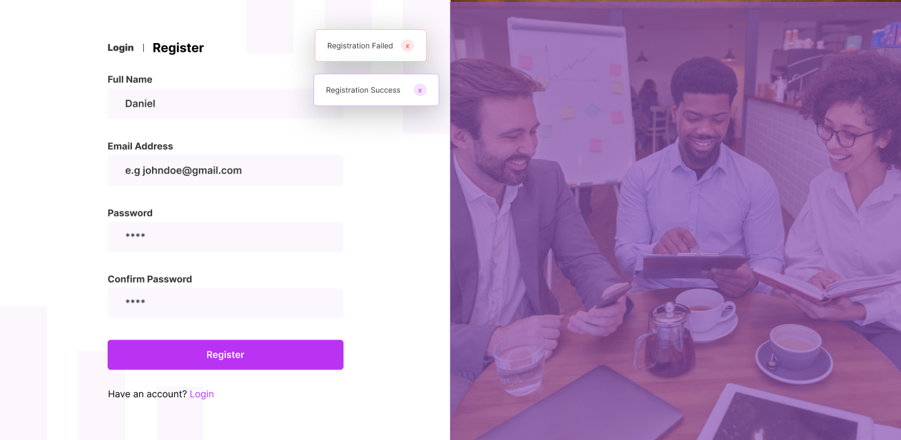
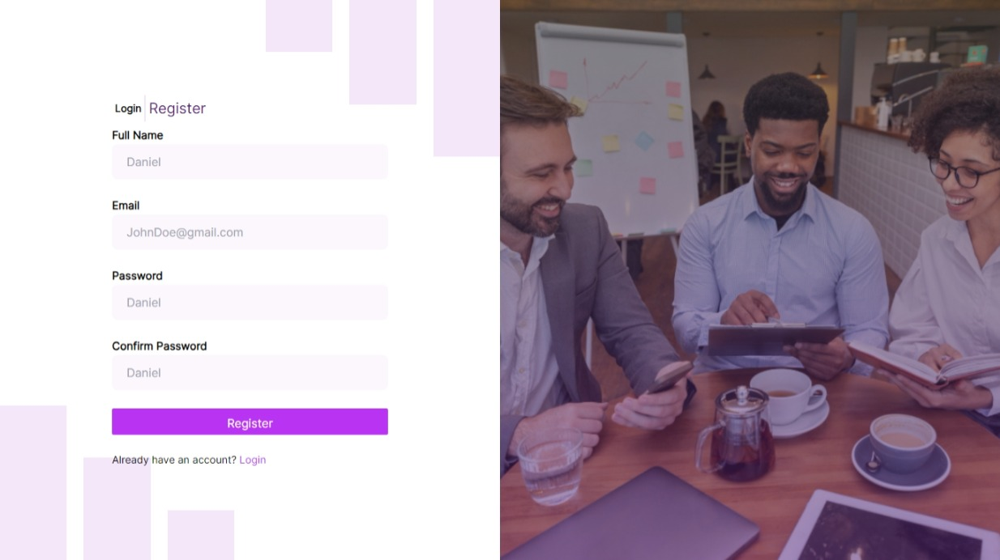
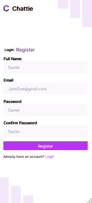
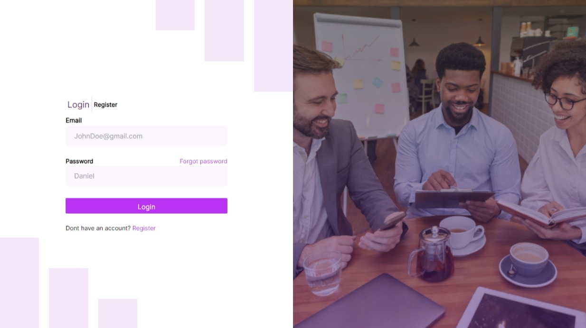
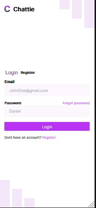

# CHATTIE




## Table of contents

- [Date](#date)
  - [Created](#created)
- [Overview](#overview)
  - [The challenge](#the-challenge)
    - [Main](#main)
    - [Added](#added)]
  - [Screenshot](#screenshot)
  - [Links](#links)
- [My process](#my-process)
  - [Built with](#built-with)
  - [What I learned](#what-i-learned)
  - [Continued development](#continued-development)
- [Author](#author)
- [Acknowledgments](#acknowledgments)

## Date
  I try to keep note of date my projects are created and will keep this readme updated whenever the codebase is modified.
  
### Created
  createdAt: 07 July, 2024.

## Overview

Thanks for checking out this repository. This project is the client side of not just a chat system, it is way more than that, a system to keep work and play together in one place. Each project is actually a challeng, learning new things or it helps you drill in to solidify already learnt logic or concepts. This challenge features the use of React, Typescript, GSAP, tailwind css and Prettier for code readabilty.

### The challenge

#### Main

- The challenge first is to build getting the result looking as close as possible to the distinct design given on figma.
- Getting users to view layout depending on their device's screen size (Responsive design)!

#### Added
- Implementing typescript.
- Implementing GSAP with typescript.
- Creating dummy data to test the app.
- Testing the app with no database.

### Screenshot







### Links

- Solution URL: [Solution](https://github.com/airxist/chattie)
- Live Site URL: [Live](https://chattie-theta.vercel.app)

## My process

### Built with

- [React](https://reactjs.org/) - JS library
- [GSAP]() - For Smooth animation
- [Tailwind Css]() - For Styling
- Typescript

### What I learned

First things first, this project has been a source of great learning for me, if you do check my repositories, you will confirm that this is the first time, I project basically with typescript full in. Learning types checking with typescript, making sure every data accross the platform was checked, trust me it wasnt easy at first, because I got a lot of errors on the text editor, which got me uncomfortable in the first place. but i feel more confident now after this. Typescript will definitely see me again.

Another moment of truth which brought another neccessity to learn, was after deployment. Apparently this project was deployed on Vercel. I noticed that trying to go to another route manually by typing on the search bar of my browser returned a 404 error. After much thinking, i researched and found that deploying a react project created with vite causes such and to resolve such challenge only needs you to create a vercel.json file in the root of your project that allows you to navigate route manually.

--- Create a vercel.json file at the root of your project and paste this in
```js
{
  "rewrites": [
    {
      "source": "/(.*)",
      "destination": "/index.html"
    }
  ]
}

```
and you're on your way.

### Continued development

In the challenges which i created for myself, I wasn't able to implement all when it comes to testing the app with no database. What I wanted to do was as follows.
- Register Users
- Login  registerd users
- Display name of registered use on dashboard and profile page
- Check collegues on same space
- Create a new space
- Try dropping a message on each space and view it when i login as another user who is on same space.

To actually do this i created  a dummy database where i had to write a data manually. This can be found in the db folder(db stands for database). Amongst the list of added challenges, I was only able to implement
- Login registered users
- Display name of registered use on dashboard and profile page

With that said, I will love to continue developing this especially when the server side is ready to interact with the client side.

## Author

- Twitter - [@betahandz](https://www.twitter.com/betahandz)

## Acknowledgments

Want to fully thank ** Daniel Kosoko ** for the design of the project.
